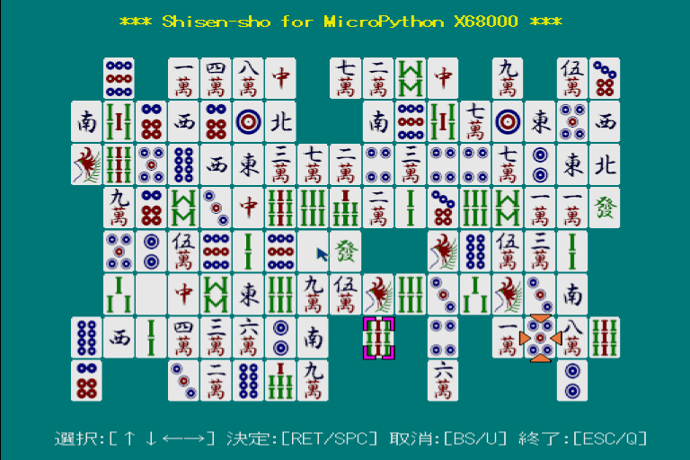

# CG sample programs for micropython-x68k

yunkさんの[MicroPython for X68000](https://github.com/yunkya2/micropython-x68k)でパズルゲーム四川省を作りました。X-BASIC風の関数群パッケージ[xbasip](https://github.com/nozwas/xbasip-x68k)を同梱し使用しています。

BGMは[あうぇっど](https://github.com/YosAwed)さんに作曲していただきました。opmdrv3.xもしくは[zmusic2.x](http://retropc.net/x68000/software/sound/zmusic/zmusic2/)をシステムに組み込んだ状態で実行してください。

## 実行方法

フォルダ直下にプリコンパイル済みの`shisen.mpy`と、麻雀牌データ`tile.dat`があります。下記のように`-m`オプションを付けてmicropythonを実行してください。

```bash
micropython.x -m shisen
```

もしくは、実行用バッチファイル`run_shisen.bat`をお使いください。



## 遊び方

操作はキーボードもしくはマウス、ジョイスティックを使用できます。有名なゲームですので説明は不要と思いますが、下記のサイトなどでルールを確認できます。

* Wikipedia：[四川省 (ゲーム)](https://ja.wikipedia.org/wiki/四川省_(ゲーム))
* ニコニコ大百科：[四川省](https://dic.nicovideo.jp/a/四川省)）

同種の牌が３本以内の水平／垂直線で結べる場合、もしくは縦横に隣接する場合、取り除くことができます。

パズルは、３つのサイズについて固定の各１問を用意しました。17×8サイズのみ、ランダムに問題を生成してプレイすることもできます。ただし、単純に乱数で牌を並べているため、稀に解けない問題が生成されることをご容赦ください。このランダムモードでは、右上に４桁の乱数シードが表示されます。次回起動時に、`micropython.x -m shisen 1234`や`run_shisen.bat 1234`と乱数シード（例では`1234`）を与えることで、再度同じ問題をプレイできます。

## ファイル構成

`shisen_src`フォルダにソースファイル`*.py`が格納されています。

```text
├── run_shisen.bat
├── shisen.mpy
├── tile.dat
├── shisen_src
│   └── shisen.py
├── xbasip
│   ├── __init__.mpy
│   ├── audio.mpy
│   ├── basic.mpy
│   ├── graph.mpy
│   ├── mouse.mpy
│   ├── music.mpy
│   ├── sprite.mpy
│   ├── stick.mpy
│   └── tgraph.mpy
├── Shisen20230506.XDF
└── README.md
```

X68000Zでプレイしやすいよう、XDFファイルを同梱しています。

## xbasipパッケージについて

X-BASIC風の関数群パッケージ`xbasip`を使用し、line()やpaint()、sp_set()、mouse()などの関数を使って実装しています。プリコンパイル済みバイナリファイルを同梱していますが、ご興味のある方は[公開サイト](https://github.com/nozwas/xbasip-x68k)を覗いてみてください。xbasipパッケージは下記のモジュールで構成されています。

* `console` -- コンソール関数群
* `graph` -- グラフィック関数群
* `sprite` -- スプライト関数群
* `audio` -- ADPCM関数群
* `music` -- FM音源関数群
* `mouse` -- マウス関数群
* `stick` -- ジョイスティック関数群
* `tgraph` -- テキストグラフィック関数群

nozwas/のずわす(https://github.com/nozwas)